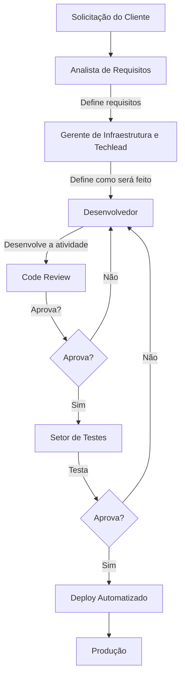

# Discord Webhook

Este projeto é um servidor Node.js que processa dados e envia mensagens para um webhook do Discord.

## Sumário

- [Pré-requisitos](#pré-requisitos)
- [Instalação](#instalação)
- [Configuração](#configuração)
- [Executando o Projeto](#executando-o-projeto)
- [Uso](#uso)
- [Scripts Disponíveis](#scripts-disponíveis)
- [Estrutura do Projeto](#estrutura-do-projeto)
- [Processo de Desenvolvimento](#processo-de-desenvolvimento)
- [Programação de Versões](#programação-de-versões)
- [Contribuição](#contribuição)
- [Licença](#licença)

## Pré-requisitos

Antes de começar, certifique-se de ter instalado em sua máquina:

- [Node.js](https://nodejs.org/) (versão 12 ou superior)
- [NPM](https://www.npmjs.com/) (normalmente instalado com o Node.js)

## Instalação

1. **Clone este repositório**

   ```bash
   git clone https://github.com/seu-usuario/discord-webhook.git
   ```

2. **Navegue até o diretório do projeto**

   ```bash 
   cd discord-webhook
   ```

3. **Instale as dependências**

   ```bash
   npm install
   ```

## Configuração

1. **Crie um arquivo .env na raiz do projeto**

   Este arquivo será usado para armazenar variáveis de ambiente sensíveis, como a URL do webhook do Discord.
   
   ```bash
   touch .env
   ```

2. **Adicione a URL do webhook ao arquivo .env**

   Abra o arquivo `.env` em um editor de texto e adicione a seguinte linha:
   
   ```bash
   DISCORD_WEBHOOK_URL=https://discord.com/api/webhooks/{webhook_id}/{webhook_token}
   ```

   Substitua `{webhook_id}` e `{webhook_token}` pelos valores correspondentes do seu webhook do Discord.

## Executando o Projeto

Para iniciar o servidor, você pode usar um dos seguintes comandos:

### Modo de Produção

```bash
npm start
```

### Modo de Desenvolvimento (com hot reload usando o Nodemon)

```bash
npm run dev
```

## Uso

Para enviar uma mensagem ao webhook do Discord:

1. **Envie uma requisição POST para o endpoint `/send-message`**

   Você pode usar ferramentas como Postman ou curl para fazer a requisição.

   Exemplo usando curl:

   ```bash
   curl -X POST http://localhost:3002/send-message \
     -H "Content-Type: application/json" \
     -d '{"message": "Sua mensagem para o Discord"}'
   ```

2. **Parâmetros da Requisição**

   - `message` (string): O conteúdo da mensagem que será enviada ao Discord.

3. **Resposta**

   - Sucesso: Status 200 OK com a mensagem "Mensagem processada com sucesso."
   - Erro: Status 500 Internal Server Error com a mensagem de erro correspondente.

## Scripts Disponíveis

No arquivo `package.json`, os seguintes scripts estão disponíveis:

- `npm start`: Inicia o servidor em modo de produção.
- `npm run dev`: Inicia o servidor em modo de desenvolvimento com o Nodemon.
- `npm test`: Executa testes (atualmente não configurado).

## Estrutura do Projeto

```bash
discord-webhook/
├── src/
│   ├── server.js          # Arquivo principal do servidor
│   └── webhookHandler.js  # Lógica para enviar mensagens ao Discord
├── .env                   # Variáveis de ambiente (adicionado ao .gitignore)
├── .gitignore             # Arquivos e pastas a serem ignorados pelo Git
├── package.json           # Dependências e scripts do projeto
├── package-lock.json      # Versões exatas das dependências instaladas
└── README.md              # Documentação do projeto
```

## Processo de Desenvolvimento

O processo de desenvolvimento do projeto funciona da seguinte maneira:

1. O **Analista de Requisitos** recebe as solicitações do cliente e define os requisitos funcionais e não funcionais.
2. Após a definição do que precisa ser feito, o **Gerente de Infraestrutura** e o **Techlead** definem como a solução será implementada dentro do software.
3. O **Desenvolvedor** recebe a documentação e desenvolve a atividade.
4. Após o desenvolvimento, o código é enviado para **Code Review** realizado pelo **Techlead**.
   - Se o código não for aprovado na revisão, ele volta para o desenvolvedor realizar ajustes.
   - Se for aprovado, ele segue para a etapa de testes.
5. O código é testado pelo **Setor de Testes**.
   - Se o código não for aprovado nos testes, ele retorna para o desenvolvedor para correção.
   - Se for aprovado nos testes, ele segue para a produção.
6. Após a aprovação nos testes, o código é enviado para **Produção** por meio de um **Deploy Automatizado**.

### Diagrama do Processo



### Atividades Explicadas

- **Solicitação do Cliente**: O cliente solicita a funcionalidade ou mudança.
- **Analista de Requisitos**: Define os requisitos funcionais e não funcionais com base nas solicitações do cliente.
- **Gerente de Infraestrutura e Techlead**: Planejam a melhor abordagem técnica para implementar a solução.
- **Desenvolvedor**: Implementa a solução de acordo com a documentação e diretrizes definidas.
- **Code Review**: Revisão do código para garantir qualidade e conformidade com os padrões de desenvolvimento.
- **Setor de Testes**: Realiza testes para garantir que a funcionalidade esteja de acordo com os requisitos e livre de erros.
- **Deploy Automatizado**: Envio da solução aprovada para o ambiente de produção automaticamente.

---

## Programação de Versões

O projeto seguirá um ciclo de entrega regular para garantir que novas funcionalidades, correções de bugs e melhorias sejam disponibilizadas de forma consistente ao cliente. O planejamento de versões será o seguinte:

### Ciclo de Entrega

- As versões do projeto serão entregues **uma vez por semana**.
- A cada semana, uma nova versão será publicada com as atualizações realizadas durante esse período.

### Branches por Versão

Para manter o controle das versões, podem ser criadas branches específicas para cada release. O processo será o seguinte:

1. **Criando a branch de versão:**

   Para cada nova versão a ser entregue, será criada uma branch com o nome correspondente à versão, por exemplo:
   
   ```bash
   git checkout -b release/v1.0.0
   ```

2. **Mesclando mudanças na branch de versão:**

   Uma vez que a branch de versão esteja criada, as funcionalidades finalizadas ou correções serão mescladas a essa branch. Isso garante que a versão estável seja preparada para a entrega ao cliente.

   As branches de funcionalidades e correções (como `feature/nova-funcionalidade` ou `fix/correcao-bug`) serão unidas à branch de versão via pull requests.

3. **Publicação da versão:**

   Após a conclusão dos testes e revisões, a branch de versão será mesclada na branch `main` ou `master`, e uma nova release será gerada.

### Exemplo de Branches de Versão

- `release/v1.0.0`: Primeira versão estável do projeto.
- `release/v1.1.0`: Segunda versão com novas funcionalidades ou melhorias.
- `release/v1.0.1`: Correção emergencial na versão 1.0.0.

### Manutenção de Releases

Cada versão publicada será acompanhada de uma tag correspondente no Git, para garantir rastreabilidade e fácil acesso a releases passadas. Exemplo:

```bash
git tag -a v1.0.0 -m "Primeira versão estável"
git push origin v1.0.0
```

O processo garante que todas as versões sejam bem documentadas e rastreáveis.

## Contribuição

Contribuições são bem-vindas! Sinta-se à vontade para abrir **issues** ou enviar **pull requests**.

### Fluxo de Trabalho

1. **Crie uma branch para sua feature ou correção de bug**

   ```bash
   git checkout -b minha-feature
   ```

2. **Faça commit das suas alterações**

   ```bash
   git commit -m "Descrição da minha feature"
   ```

3. **Envie para o repositório remoto**

   ```bash
   git push origin minha-feature
   ```

4. **Abra um pull request no GitHub.**

## Licença

Este projeto está licenciado sob a [Licença MIT](LICENSE).

---

**Autor:** Natã Giertyas

**Contato:** natadasilva10@gmail.com
